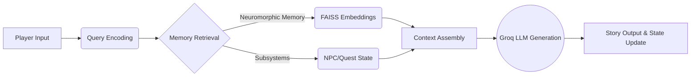

<div align="center">
  
# 🧠 DungeonBrain++ 
### Neuromorphic Memory-Augmented Dungeon Master

[](https://fastapi.tiangolo.com/)
[](https://sbert.net/)
[](https://spacy.io/)
[](https://groq.com/)
[](https://faiss.ai/)

A biologically-inspired memory system for long-horizon interactive storytelling in text-based RPGs.
</div>

---

## 🌟 Overview

**DungeonBrain++** integrates neuromorphic episodic memory with transformer-based LLMs to maintain coherent narratives across extended conversations spanning multiple sessions. It acts as an advanced, AI-driven Dungeon Master capable of managing game state, remembering past player actions, and producing creative and context-aware storytelling.

## ✨ Key Features

- 🧠 **Neuromorphic Event Memory**: Salience-based episodic storage with attention-driven retrieval to focus on what truly matters in the story.
- 🔗 **Associative Memory Networks**: Spreading activation enables recall of narratively connected events, mimicking human memory recall.
- 🎯 **Multi-Factor Retrieval**: Combines semantic similarity, temporal recency, salience, and permanence scoring for accurate memory fetching.
- 🧹 **Memory Consolidation**: Biologically-inspired link pruning and strengthening to prevent memory bloat and optimize context windows.
- 🎭 **Specialized Subsystems**: Dedicated state tracking for **NPCs** (relationships & stats), **Quest Logs**, and **World State**.
- 💾 **Session Persistence**: Complete state save/load mechanisms to support multi-session, long-running campaigns.
- ⚡ **Lightning Fast AI**: Powered by **Groq** for instantaneous LLM inference, ensuring real-time interactivity.

## 🏗️ Architecture



### Core Components
1. **Neuromorphic Event Memory**: Uses 384-dimensional semantic embeddings (Sentence-BERT) with FAISS indexing for efficient retrieval.
2. **NPC Memory System**: Structured character profiles with temporal metadata, tracked relationship states, and Named Entity Recognition (NER).
3. **Quest Log**: Regex-based active quest detection with state management (active, completed, failed).
4. **Slot Memory**: Lightweight environmental context tracking (location, time, party, inventory).

## 🚀 Tech Stack

- **Backend**: Python 3.8+, FastAPI, Uvicorn
- **AI/ML**: Groq API, Sentence-Transformers, spaCy, FAISS
- **Frontend**: Vanilla HTML, CSS (Glassmorphism UI), JavaScript

## 💻 Installation & Setup

Follow these steps to run DungeonBrain++ locally on your machine.

### 1. Clone the repository
```bash
git clone https://github.com/your-username/AI-ML-Bootcamp.git
cd AI-ML-Bootcamp
```

### 2. Set up the Python Environment
```bash
# Create and activate a virtual environment
python -m venv venv
source venv/bin/activate  # On Windows use `venv\Scripts\activate`

# Install dependencies
pip install -r backend/requirements.txt
python -m spacy download en_core_web_sm
```

### 3. Environment Variables
Create a `.env` file in the root directory and add your Groq API key:
```env
GROQ_API_KEY=your_api_key_here
```

### 4. Run the Application
Start the FastAPI server which also serves the frontend:
```bash
uvicorn backend.app:app --reload
```

The application will be available at **`http://localhost:8000`**.

---

## 📂 Project Structure

```text
AI-ML-Bootcamp/
├── .env                        # Environment variables
├── backend/                    # FastAPI backend
│   ├── app.py                  # Server entry point
│   ├── routes.py               # API endpoints
│   ├── schemas.py              # Pydantic models
│   ├── session_manager.py      # Core memory architecture logic
│   └── requirements.txt        # Python dependencies
├── frontend/                   # UI Assets
│   ├── index.html              # Main HTML entry
│   ├── styles.css              # Glassmorphic UI styles
│   └── app.js                  # Frontend logic
├── main.py                     # Original CLI interface / core logic
└── README.md                   # This file!
```

## 🎥 Demos

- [Sample Video 1](https://drive.google.com/file/d/1lzY8X3Ukoo5yfsI393hA2RkdWIUhcGKE/view?usp=sharing)
- [Sample Video 2](https://drive.google.com/file/d/1C1Xg_7TE7WVot6qpEWD1_niWxcJOD4c_/view?usp=sharing)

## 📄 License
This project is licensed under the MIT License - see the LICENSE file for details.
